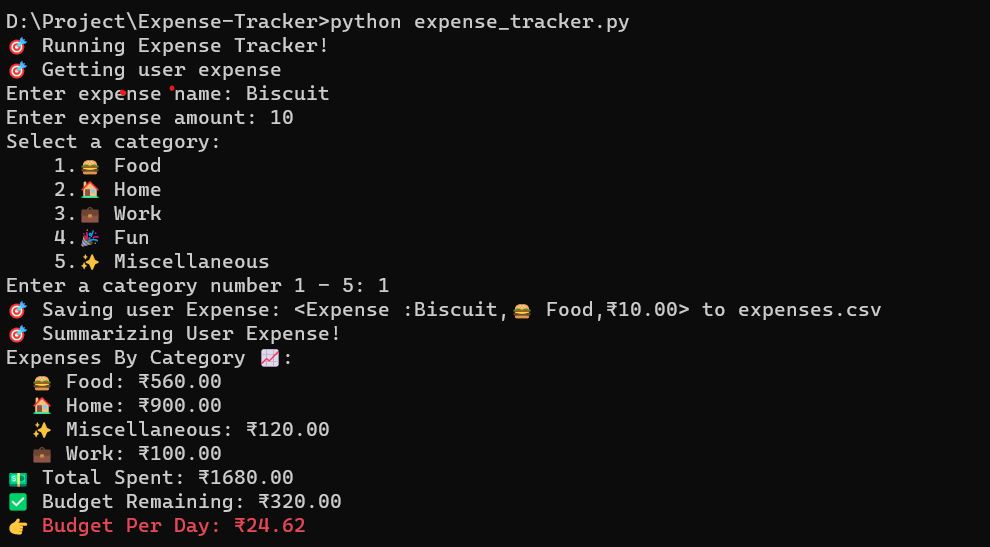

#  💸 Personal Expense Tracking 

The Personal Expense Tracking App is a Python application designed to help users track, categorize, and manage their monthly expenses efficiently. It offers a simple and intuitive interface accessible directly from the terminal.

## ✅ Key Features

- **Expense Entry:** Users can conveniently input their expense category and amount directly into the terminal.
- **Data Persistence:** The app saves each expense entry to a file for easy retrieval and future reference.
- **Expense Summarization:** It summarizes the total expenses for the month, providing insights into spending patterns.
- **Budget Management:** Users can set a custom monthly budget, and the app calculates how much they can spend for the remaining days of the month to stay within budget.
  
### ✨ Bonus Features

1. **Expense Categorization:** The app categorizes expenses and presents them in a clear and organized manner.
2. **Daily Budget Estimate:** It estimates the amount users have left to spend per day to help them manage their expenses effectively.

##  📸 Example Screenshot


##  💻 Installation

1. Clone the repository:

   ```bash
   git clone https://github.com/Prathvi-Shetty29/Expense-Tracker.git
